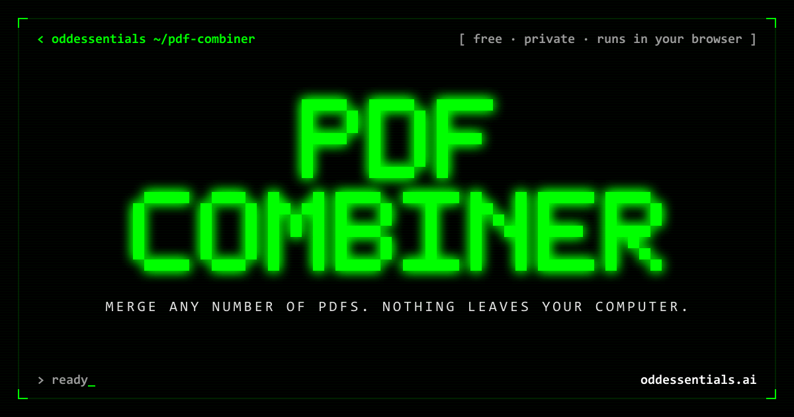

[](https://oddessentials.github.io/pdf-combiner/)

# PDF Combiner

Merge any number of PDFs into one file, right in your browser. Free, private, and nothing is uploaded.

**[Open PDF Combiner →](https://oddessentials.github.io/pdf-combiner/)**

## How to use it

1. Drag your PDFs onto the page, or click **Choose PDFs**.
2. Put them in order with the **↑** and **↓** buttons. Remove any with **✕**.
3. Optionally change the file name under **Save as**.
4. Click **Combine PDFs**. Your browser downloads the combined file.

## Your files stay private

All the work happens inside your browser. Your PDFs are never uploaded anywhere, not even to us.

## Run it on your own computer

Prefer to run it offline? You'll need [Node.js](https://nodejs.org) 18 or newer.

1. Open a terminal in this folder and install once:

   ```
   npm install
   ```

2. Start the app:

   ```
   npm start
   ```

   Your browser opens automatically. If it doesn't, open the address shown in the terminal (usually http://localhost:3000).

To stop the app, press `Ctrl+C` in the terminal.

## Troubleshooting

| Problem | Fix |
|---|---|
| "This PDF is password-protected" | Open it in your PDF viewer, save a copy without the password, and add that copy. |
| "This file looks damaged" | Re-download or re-save the file, then add it again. |
| "pdf-lib is missing" | Run `npm install`, then `npm start` again. |
| Port already in use | The app tries the next port by itself and prints the address. To pick one: `PORT=4000 npm start` (PowerShell: `$env:PORT=4000; npm start`). |
| Don't want the browser to open | Start with `NO_OPEN=1 npm start` (PowerShell: `$env:NO_OPEN=1; npm start`). |

## Good to know

- Page content always carries over. Bookmarks, internal links, and fillable form fields may not.
- Very large jobs (hundreds of MB) are limited by your browser's memory and may be slow.

## Support our work

PDF Combiner is made by [Odd Essentials](https://oddessentials.ai). If it saved you time, please consider a [donation](https://oddessentials.ai/donate/). ♥
